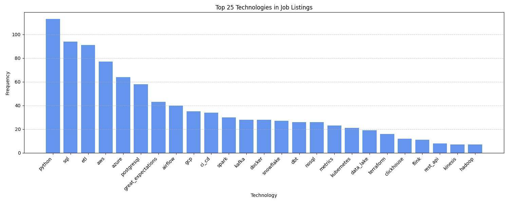

# Job Scraper & Analyzer

A structured Python project that scrapes job vacancies for **Data Engineers** from job websites (like **dow.ua**), extracts **technologies** using keyword matching, and stores everything in a **SQLite** database. It supports **CSV export**, **database viewing**, and **tech analysis** via charts and tables.

---

## 🛠️ Technologies


## 🔥 Features

- 🔍 Scrape job vacancies using Selenium & BeautifulSoup
- 🧠 Extract technologies from descriptions using predefined keyword dictionary
- 🗃️ Store vacancies, technologies & relations in a normalized SQLite DB
- 📤 Export results to CSV
- 📈 Analyze top technologies using Matplotlib + Pandas
- 🖥️ View job records and tech keywords in a tabulated format

## 📦 Project Structure

| File/Folder            | Description                                     |
| ---------------------- | ----------------------------------------------- |
| `main.py`              | 🎯 Main entry point for the scraper             |
| `Makefile`             | ⚙️ Useful CLI commands (run, view, export)      |
| `requirements.txt`     | 📦 Python dependencies                          |
| `README.md`            | 📘 Project documentation                        |
| `data/`                | 🗂️ Output folder for database and CSV files     |
| ├── `top_techs.png`    | 📈 Chart top technologies                       |
| ├── `vacancies.db`     | 🧱 SQLite database file                         |
| └── `vacancies.csv`    | 📄 CSV output with parsed job data              |
| `src/`                 | 🧠 Source code                                  |
| ├── `scraper.py`       | 🕷️ Scraping logic with Selenium & BeautifulSoup |
| ├── `sqlite_db.py`     | 🗃️ SQLite database interactions                 |
| ├── `export.py`        | 📤 CSV export logic                             |
| ├── `show_db.py`       | 👀 Show DB contents                             |
| ├── `tech_keywords.py` | 🧠 Dictionary of tech stack terms               |
| └── `analysis.py`      | 📈 Analysis + chart of top N technologies       |

---

## 🧩 Example Result Parsing (SQLite tables Vacancies, Technologies)

<pre>
📋 Vacancies:
+-----+---------------------------------------------+------------+-----------+
| ID  | Title                                       | Company    | Link      |
+-----+---------------------------------------------+------------+-----------+             
| 1   | Senior Backend Engineer (Data Processing)   | Shelf      | [Link]    |
| 2   | Data Engineer (JustDone)                    | Boosters   | [Link]    |
| 3   | R&D CV/ML Engineer (Drones — Miltech)       | A19Lab.com | [Link]    |
| 4   | ML/DL Engineer (Рекомендаційні моделі)      | ROZETKA    | [Link]    |
| 5   | Sr. DevOps Engineer / Data Architect        | Datagrok   | [Link]    |
</pre>

<pre>
🧪 Technologies:
+----+--------------------+
| ID | Technology         |
+----+--------------------+
| 1  | AWS                |
| 2  | Azure              |
| 3  | Elastic            |
| 4  | ETL                |
| 5  | Great Expectations |
</pre>

## 📈 Example result analysis

Top technologies:

#### Tables

<pre>
+----+------------------------+
| №  | Technology | Frequency |
+----+------------+-----------+
| 1  | python     |    113    |
| 2  | sql        |     94    |
| 3  | etl        |     91    |
| 4  | aws        |     77    |
| 5  | azure      |     64    |
</pre>

#### Chart



## 🚀 Run Project: Makefile Commands

| Command        | Description                                                            |
| -------------- | ---------------------------------------------------------------------- |
| `make run`     | Runs the main scraper script to collect job listings.                  |
| `make initdb`  | Initializes the SQLite database by creating necessary tables.          |
| `make showdb`  | Displays the contents of the database (vacancies and technologies).    |
| `make analyze` | Performs analysis on the data and shows top technologies with a chart. |
| `make clean`   | Removes the database and CSV files to clean the workspace.             |

### Usage Examples

- Run the scraper and save data:

  ```bash
  make run
  ```

---

## 👤 About the Author

This project was developed by **Arsen Vasylyshyn**, a dedicated Data Engineer specializing in data processing and automation.

---

## 🔗 GitHub Author Repository

You can find other project repositories and related resources on GitHub:

[](https://github.com/ArsenVasylyshyn)
